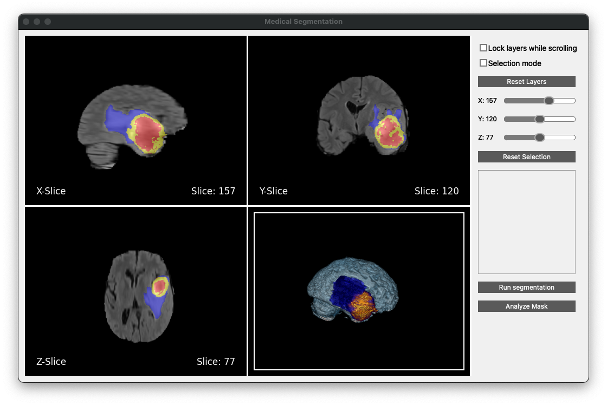
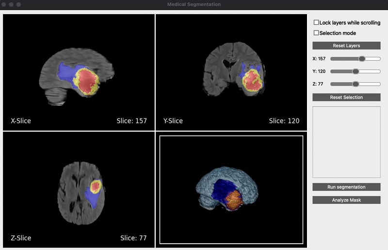
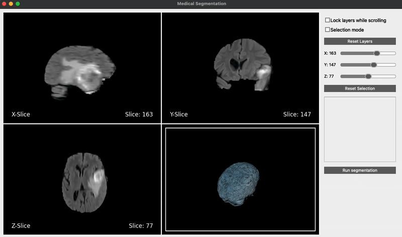

# Medical Segmentation

Desktop application for medical image analysis and segmentation using SAM2 (Segment Anything Model v2). This tool provides an intuitive interface for loading, viewing, and segmenting medical images in NIFTI format.



## Key Features

### Multi-View Medical Image Visualization
- **Orthogonal Views**: Simultaneous display of axial, sagittal, and coronal planes
- **3D Volume Rendering**: Interactive 3D visualization of the medical volume
- **Synchronized Navigation**: Coordinated slice navigation across all views
- **Dark/Light Mode**: Customizable interface appearance




### Advanced Segmentation Capabilities
- **Interactive Point Selection**: Simple point-and-click interface for marking regions of interest
- **Positive/Negative Prompts**: Support for both inclusion and exclusion points




### Analysis Tools
- Volume measurement
- Surface area calculation
- Centroid location
- Bounding box dimensions

### File Management
- Support for NIFTI formats (`.nii`, `.nii.gz`)
- Multiple modality channels
- Mask overlay visualization
- Save/load functionality for both images and masks

### Installation

1. Clone the repository:
```bash
git clone <repository-url>
cd medical-segmentation
```

2. Create and activate a virtual environment:
```bash
python -m venv .venv
source .venv/bin/activate  # Linux/Mac
```

3. Install dependencies:
```bash
pip install -r requirements.txt
```

4. Download the SAM2 model checkpoint:
```bash
cd checkpoints
./install.sh
```

## Usage Guide

### Starting the Application
```bash
python main.py
```

### Basic Workflow
1. **Load Data**: 
   - File → Load → Select NIFTI file
   - Supported formats: .nii, .nii.gz

2. **View Manipulation**:
   - Mouse wheel: Scroll through slices
   - Double-click: Expand/collapse views
   - Settings menu: Toggle dark/light mode

3. **Segmentation**:
   - Left click: Add positive points
   - Right click: Add negative points
   - Run segmentation button: Process points

4. **Analysis**:
   - View mask overlays
   - Check measurements
   - Export results

## Architecture

### Model-View-Controller (MVC) Pattern
- **Model**: 
  - NIFTI data handling
  - Segmentation processing
  - Analysis calculations

- **View**: 
  - PyQt5-based GUI
  - Matplotlib for 2D visualization
  - Vedo for 3D rendering

- **Controller**: 
  - User interaction handling
  - Model-view coordination
  - State management

### Project Structure
```
medical-segmentation/
├── model/           # Data handling and analysis
├── gui/             # User interface components
├── segmentation/    # SAM2 integration
├── test/            # Unit tests
```
